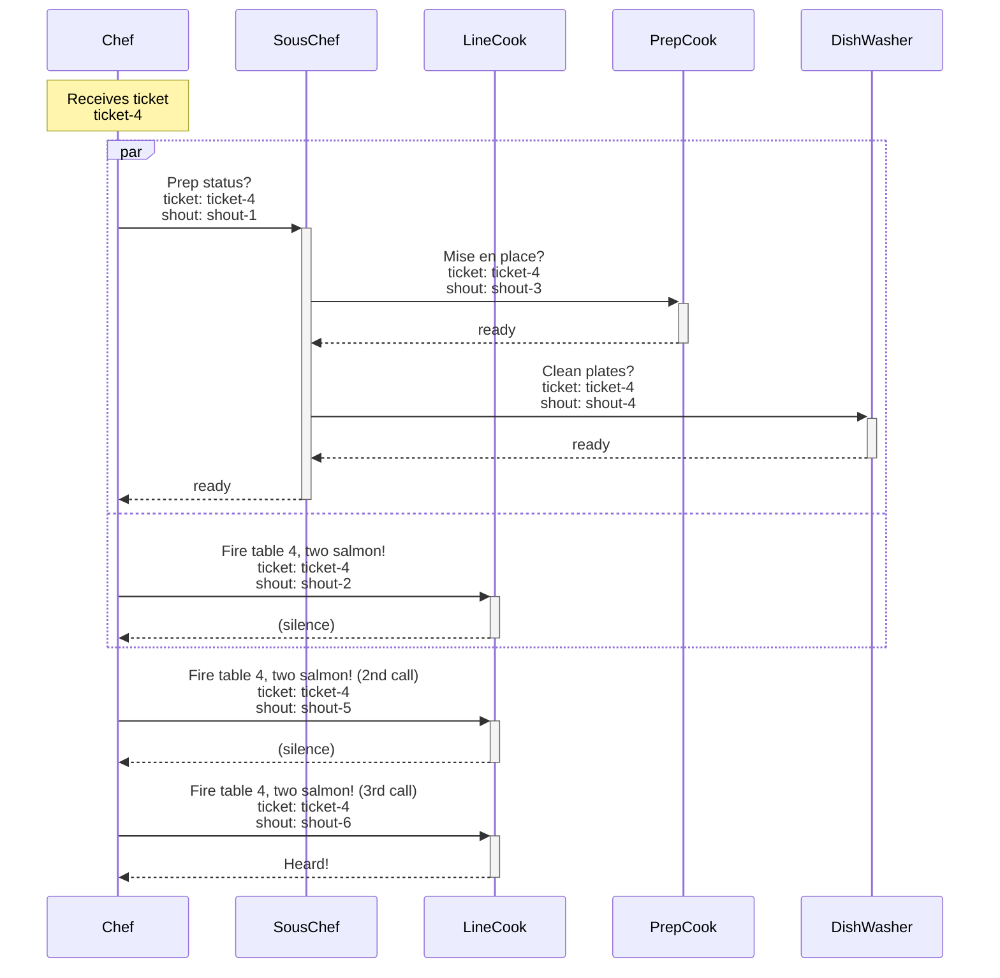

# Kitchen brigade full sequence diagram

Mermaid source for the full kitchen brigade sequence diagram. Rendered to `articles/_sources/devto-post-2026-06-correlation-id-vs-request-id-full-sequence.png`.

<!-- Render: mmdc -i articles/_sources/devto-post-2026-06-correlation-id-vs-request-id-full-sequence.md -o articles/_sources/devto-post-2026-06-correlation-id-vs-request-id-full-sequence.png -b transparent -->

