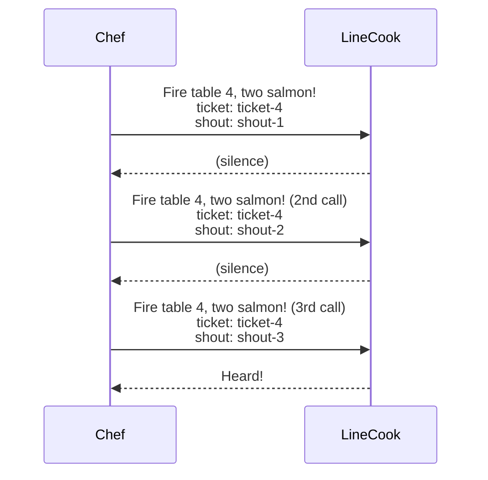

# Chef retries LineCook sequence diagram

Mermaid source for the Chef retrying LineCook sequence diagram. Rendered to `articles/_sources/devto-post-2026-06-correlation-id-vs-request-id-shout-retry.png`.

<!-- Render: mmdc -i articles/_sources/devto-post-2026-06-correlation-id-vs-request-id-shout-retry.md -o articles/_sources/devto-post-2026-06-correlation-id-vs-request-id-shout-retry.png -b transparent -->

